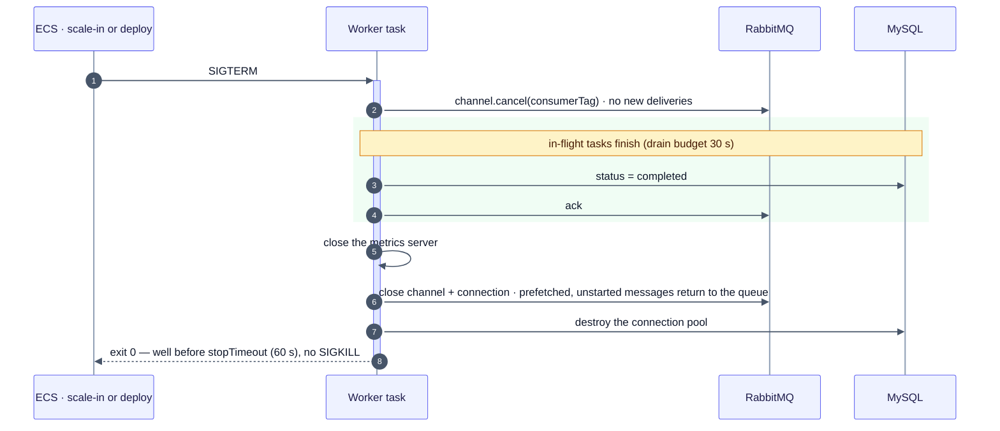
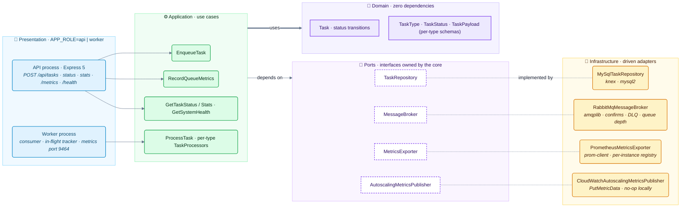
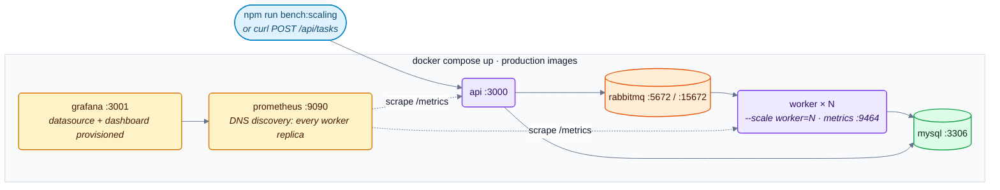

# ☁️ edtech-cloud-deploy

> Containerized Node.js task workers that scale **elastically on queue backlog** — stateless
> workers, graceful shutdown, Terraform for AWS ECS/Fargate + RDS, CI/CD and Prometheus/Grafana,
> with the scaling and shutdown behaviour measured locally.

[](https://www.typescriptlang.org/)
[](https://nodejs.org/)
[](https://docs.docker.com/build/building/multi-stage/)
[](infra/terraform)
[](https://aws.amazon.com/)
[](#-tests)
[](#-tests)
[](./LICENSE)

---

## 🎯 The Problem

An EdTech platform pushes background tasks (emails, reports, LMS/SIS syncs, certificates) to
RabbitMQ. Demand is spiky — enrollment day, grade publication — and the workers are I/O-bound:
CPU stays at 20–30% while thousands of messages pile up, so **CPU-based auto-scaling never
fires**. The deployment must:

1. run **stateless** containers so any replica can take any message;
2. scale the workers on **queue backlog**, not CPU;
3. keep the database managed and separate (RDS);
4. never lose a task when a container is stopped (scale-in, deployment);
5. ship through CI/CD and be observable.

## 💡 The Solution on AWS

```mermaid
%%{init: {"theme": "base", "themeVariables": {"fontFamily": "Inter, Segoe UI, Helvetica, Arial, sans-serif", "fontSize": "15px", "lineColor": "#64748B", "primaryTextColor": "#0F172A", "clusterBkg": "#F8FAFC", "clusterBorder": "#CBD5E1", "titleColor": "#0F172A", "edgeLabelBackground": "#FFFFFF"}, "flowchart": {"curve": "basis", "nodeSpacing": 26, "rankSpacing": 40, "padding": 12, "wrappingWidth": 220}}}%%
flowchart LR
    CLIENT(["🌐 LMS / clients"])
    ALB["Application Load Balancer<br/><i>health check GET /health</i>"]
    MQ[("🐇 RabbitMQ<br/><i>Amazon MQ or self-hosted · edtech.tasks + DLQ</i>")]
    RDS[("🗄️ RDS MySQL 8<br/><i>Multi-AZ in prod</i>")]
    CW["📈 CloudWatch metric math<br/><i>QueueDepth ÷ RunningTaskCount</i>"]
    AAS{{"Auto Scaling · target tracking<br/><i>50 messages per worker task · 2 → 10 tasks</i>"}}

    subgraph ECS["ECS Fargate cluster — Terraform modules alb · ecs · rds · autoscaling"]
        API("API service<br/><i>POST /api/tasks · samples queue depth every 15 s</i>")
        WORKERS("Worker service<br/><i>stateless tasks · prefetch 10 · stopTimeout 60 s</i>")
    end

    CLIENT --> ALB --> API
    API -->|"publish · persistent + confirmed"| MQ
    MQ -->|"consume"| WORKERS
    WORKERS -->|"status · ack after commit"| RDS
    API -->|"PutMetricData"| CW
    CW -->|"backlog per task"| AAS
    AAS -->|"desired count"| WORKERS

    classDef edge fill:#E0F2FE,stroke:#0284C7,stroke-width:1.5px,color:#0C4A6E
    classDef compute fill:#EDE9FE,stroke:#7C3AED,stroke-width:1.5px,color:#2E1065
    classDef data fill:#DCFCE7,stroke:#16A34A,stroke-width:1.5px,color:#052E16
    classDef scale fill:#FEF3C7,stroke:#D97706,stroke-width:1.5px,color:#451A03
    classDef queue fill:#FFEDD5,stroke:#EA580C,stroke-width:1.5px,color:#431407

    class CLIENT,ALB edge
    class API,WORKERS compute
    class RDS data
    class CW,AAS scale
    class MQ queue

    style ECS fill:#F5F3FF,stroke:#C4B5FD,color:#2E1065

    linkStyle 5,6,7 stroke:#D97706,stroke-width:2px
```



- **Backlog-based scaling** — the API samples the queue depth every 15 s and publishes
  `Custom/EdTech QueueDepth`; CloudWatch metric math divides it by `RunningTaskCount` and
  Application Auto Scaling tracks **50 messages per worker task** (2 → 10 tasks).
  ([ADR-002](docs/adr/002-queue-based-autoscaling.md))
- **Stateless workers** — no local state: a task's status lives in MySQL, messages in RabbitMQ,
  acknowledged only after the status is committed. ([ADR-001](docs/adr/001-stateless-containers.md))
- **Graceful shutdown** — ECS sends SIGTERM on scale-in and deploys; the worker stops consuming,
  drains in-flight tasks and exits before `stopTimeout`. ([ADR-005](docs/adr/005-graceful-shutdown.md))
- **Managed database** — RDS MySQL 8, Multi-AZ in prod, private subnets, reachable only from ECS
  tasks. ([ADR-003](docs/adr/003-managed-database.md))
- **Multi-stage image**, non-root, with a container health check. ([ADR-004](docs/adr/004-multi-stage-docker.md))

### Graceful shutdown



---

## 📊 Verified Results — `npm run bench:scaling`

Measured on 2026-10-06 against the local docker-compose stack (production images, RabbitMQ 3,
MySQL 8). Each task simulates 250 ms ± 50% of work and fails transiently 2% of the time (then
retried); prefetch 10 per worker. Report: [`benchmarks/scaling-results.md`](benchmarks/scaling-results.md).

### Horizontal scaling — the same 2,000-task backlog, more stateless replicas

| Worker replicas | Drain time | Throughput | Per worker | Speed-up | Failed |
|---:|---:|---:|---:|---:|---:|
| 1 | 71.6 s | 27.9 tasks/s | 27.9 tasks/s | 1.00× | 0 |
| 2 | 37.0 s | 54.0 tasks/s | 27.0 tasks/s | **1.94×** | 0 |
| 4 | 22.3 s | 89.9 tasks/s | 22.5 tasks/s | **3.22×** | 0 |

Throughput grows almost linearly with replicas — which is what makes scaling on backlog worth it.
At 4 replicas the per-worker rate drops because the single MySQL and RabbitMQ containers on one
laptop start to be shared by more consumers.

### Graceful shutdown — SIGTERM to one of 2 workers in the middle of a 1,000-task load

| Completed when SIGTERM was sent | In-flight at stop | Drain time | Completed | Failed | Stuck in `processing` | **Lost** |
|---:|---:|---:|---:|---:|---:|---:|
| 338 | 10 | **723 ms** | 1,000 | 0 | 0 | **0** |

The stopped worker cancelled its consumer, finished its 10 in-flight tasks in 723 ms and exited
cleanly; the other replica processed the rest. 30 tasks show `attempts > 1` — the 2% simulated
transient failures, retried as designed (146 of 7,051 tasks over the whole session = 2.07%).

### Infrastructure & delivery checks

| Check | Result |
|---|---|
| `terraform fmt -check -recursive` | ✅ clean |
| `terraform init -backend=false && terraform validate` — `dev` and `prod` | ✅ valid (AWS provider 5.100.0) |
| `actionlint` on `ci.yml` and `deploy.yml` | ✅ no findings |
| Production image | 299 MB = `node:22-alpine` base (238 MB) + 61 MB app (51 MB production `node_modules`, 1.2 MB `dist`), no dev dependencies, non-root |
| Prometheus targets | API + **every** worker replica (DNS service discovery), all `up` |
| Grafana | Prometheus datasource and the "EdTech Task Queue & Worker Autoscaling" dashboard provisioned at startup |

> Nothing was deployed to AWS: the Terraform and the workflows are validated, the auto-scaling
> policy itself has not been exercised on a real ECS cluster.

---

## 🏗️ Architecture

**Clean Architecture + DDD + TypeScript (strict)** — one image, two roles (`APP_ROLE=api|worker`).



```
src/
├── domain/           # Task entity (transitions), TaskType, TaskStatus, TaskPayload (per-type schemas)
├── application/      # EnqueueTask, ProcessTask (+ per-type processors), RecordQueueMetrics, status/stats/health
├── infrastructure/   # RabbitMQ broker, MySQL repository, prom-client exporter, CloudWatch publisher, config, lifecycle
└── presentation/     # Express API, worker runtime (in-flight tracker), bootstrap per role
infra/terraform/      # modules: alb · ecs · rds · autoscaling — environments: dev · prod
monitoring/           # prometheus.yml · Grafana provisioning + dashboard JSON
.github/workflows/    # ci.yml (quality gates + terraform validate) · deploy.yml (ECR + ECS via OIDC)
```

### Architecture decisions

| ADR | Decision |
|---|---|
| [ADR-001](docs/adr/001-stateless-containers.md) | Stateless containers for horizontal scaling |
| [ADR-002](docs/adr/002-queue-based-autoscaling.md) | Auto-scale on backlog per task, not CPU (revised: metric math + dimensions) |
| [ADR-003](docs/adr/003-managed-database.md) | RDS instead of MySQL in a container |
| [ADR-004](docs/adr/004-multi-stage-docker.md) | Multi-stage builds for small, safe images |
| [ADR-005](docs/adr/005-graceful-shutdown.md) | Graceful shutdown for queue consumers |

---

## 🔌 API

| Method | Path | Description |
|---|---|---|
| `POST` | `/api/tasks` | `{ type, payload }` validated per task type → `202 { taskId, status, statusUrl }` |
| `GET` | `/api/tasks/:id` | Task status, attempts, result / error |
| `GET` | `/api/tasks/stats` | Tasks per status + RabbitMQ queue depth |
| `GET` | `/metrics` | Prometheus (`task_processed_total`, `task_processing_duration_seconds`, `queue_depth`, `tasks_in_flight`, Node defaults) — workers expose it on `:9464` |
| `GET` | `/health` | MySQL + RabbitMQ |

Task types: `email_notification`, `report_generation`, `data_sync`, `certificate_generation`.

---

## 🚀 Run Locally



```bash
docker compose up -d --build                 # MySQL, RabbitMQ, API, 2 workers, Prometheus, Grafana
curl localhost:3000/health
docker compose up -d --scale worker=4        # add replicas
npm install && npm run bench:scaling         # the measurements above (~4 min)
```

- RabbitMQ UI: <http://localhost:15672> (guest / guest) · Prometheus: <http://localhost:9090> ·
  Grafana: <http://localhost:3001> (admin / admin)
- `docker-compose.localstack.yml` starts LocalStack (CloudWatch, SQS, ECS APIs) for local AWS
  experiments; it was not part of the measurements above.

## ☁️ Deploy to AWS

```bash
cd infra/terraform/environments/dev          # or prod
cp terraform.tfvars.example terraform.tfvars # fill in image, rabbitmq_url, db password…
terraform init && terraform plan
```

`deploy.yml` builds the image, pushes it to ECR and rolls the ECS services out, assuming an IAM
role through GitHub OIDC (`AWS_DEPLOY_ROLE_ARN` secret) — no long-lived keys.

## 🧪 Tests

```bash
npm test               # 26 suites, 222 tests
npm run test:coverage  # 97.1% statements · 89.9% branches · 95.0% functions · 97.2% lines
```

Unit tests cover the entity and value objects, every use case, the per-type processors, the
in-flight tracker and worker runtime, the RabbitMQ/MySQL/metrics adapters (with fakes), the HTTP
layer and graceful shutdown. Integration (Testcontainers) and e2e suites are not written yet;
end-to-end behaviour is verified against the real stack by `npm run bench:scaling`.

## 🛠️ Scripts

| Script | Description |
|---|---|
| `npm run dev:api` / `npm run dev:worker` | API / worker with hot reload |
| `npm run build` / `npm run start:api` / `npm run start:worker` | Production build and processes |
| `npm run migrate` / `npm run migrate:rollback` | Database migrations |
| `npm run bench:scaling` | Scaling + graceful-shutdown verification → `benchmarks/scaling-results.md` |
| `npm run load-test` | API enqueue load test |
| `npm run docker:localstack` | LocalStack variant |
| `npm run lint` / `typecheck` / `format:check` | Quality gates |

## 📚 Tech Stack

| Technology | Role |
|---|---|
| **TypeScript 5.9** (strict) · **Node.js 22** | Language & runtime |
| **Express 5** · **amqplib** · **knex** / mysql2 | API, RabbitMQ, MySQL |
| **prom-client** · **Prometheus** · **Grafana** | Metrics & dashboards |
| **AWS SDK (CloudWatch)** | Queue-depth metric for auto-scaling |
| **Terraform** (AWS provider 5) | ECS/Fargate, ALB, RDS, Application Auto Scaling |
| **GitHub Actions** | CI quality gates, Terraform validation, ECR/ECS deploy via OIDC |
| **Docker** multi-stage · **Docker Compose** | Images and local stack |
| **Jest** | Unit tests |

## 📄 License

[MIT](./LICENSE)
